# ADNS2610
Simple, small and lightweight library for ADNS2610 and Arduino. 
The ADNS2610 is a common mouse sensor, mostly used in Logitech mice. With that library, you can create:
- simple gesture sensor
- color sensor
- movement sensor
- grayscale or color camera

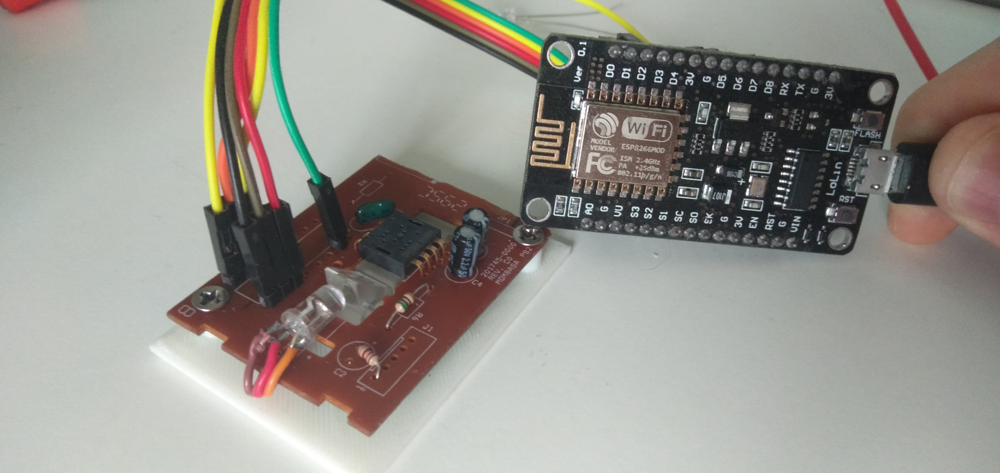
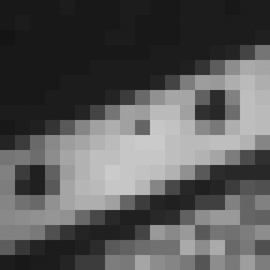
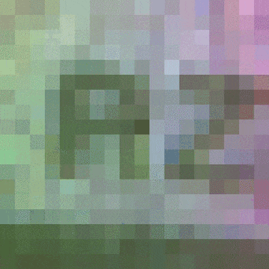

## Connection
If you get your sensor from a mouse, you can just unsolder the driver IC and solder some goldpins for easy connection. If you want to create standalone module, here's scheme:
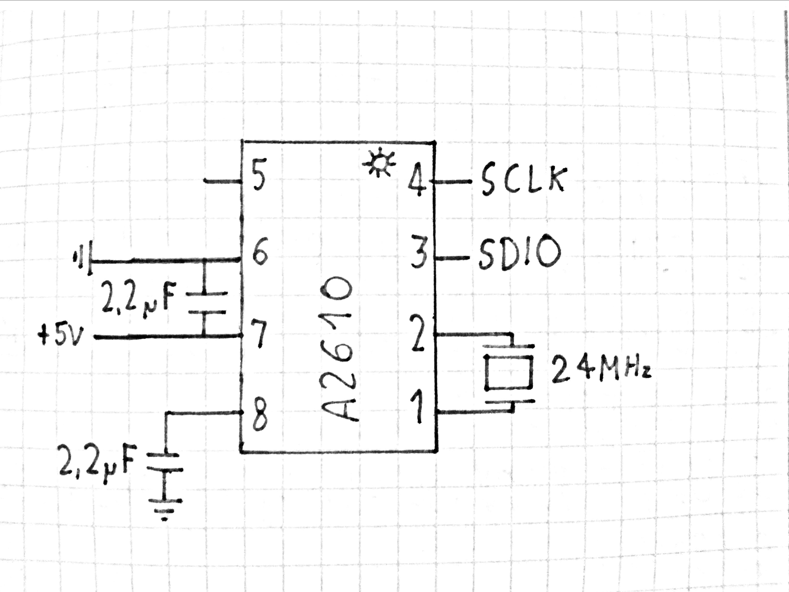
You also have to connect a red LED, or RGB LED to your microcontroller. Then, mount your LED near stock lenses. If you want, there's 3D model to print for OV7670 lenses.
As far as I did, the library works on Arduino Nano and NodeMCU, with Arduino IDE and Platformio. Other platforms are untested.
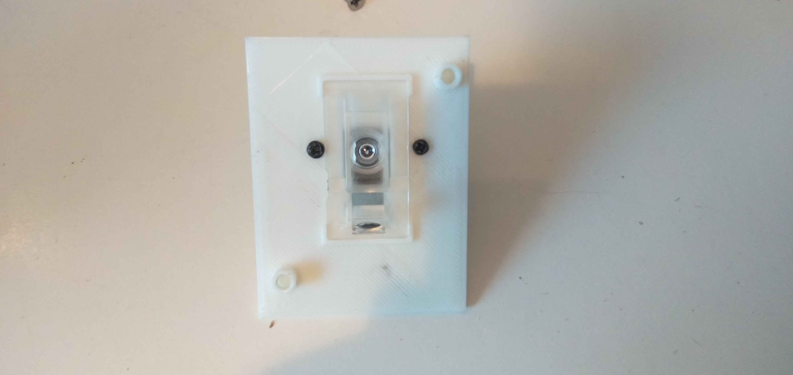
## Configuration
Implementing your mouse is very simple. Just create a mouse object:
```
ADNS2610 adns(sdio, sckl, led);
```
If you have a RGB LED, use this instead:
```
ADNS2610 adns(sdio, sclk, ledr, ledg, ledb);
```
In `setup()` function, you have to awake the mouse. 'True' means that we will force the mouse to stay on:
```
adns.begin(true);
```
I wrote some debug functions, if you want:
```
adns.blinkLED();
adns.backlight(true);
Serial.begin(115200);
adns.debug();
```
First function will blink your LED(s). Then, if you have stock lenses, you should turn the backlight on. `adns.debug()` actually does nothing useful, yet.

Then you can call some functions in `loop()`:
```
adns.readFrame(frame, 'r');
for(int s=0; s < 324; s++) Serial.write((byte) frame[s]);
```
This will capture the frame into `byte frame[324]` - the resolution of sensor is 18x18, what gives us 324 pixels. Then we send the frame via serial. Second argument is optional, it tells the library in what color you want the frame.
```
Serial.println(adns.getAvgPixel('r'));
Serial.println(adns.getAvgPixel('g'));
Serial.println(adns.getAvgPixel('b'));
```
This reads average pixel value, and if you want, in defined color.
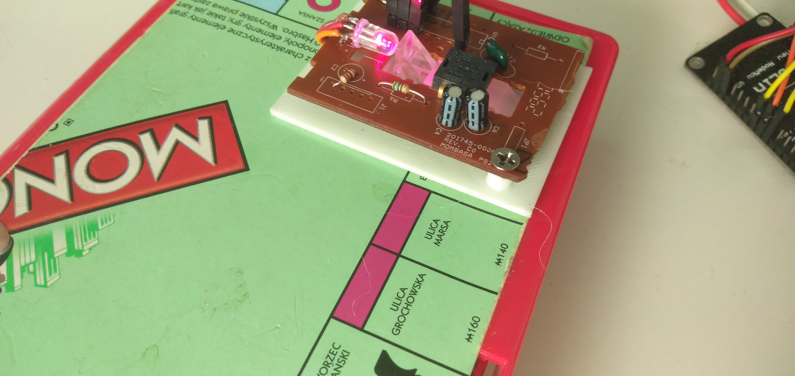
```
x = adns.getDeltaX();
y = adns.getDeltaY();
min = adns.getMinPixel();
max = adns.getMaxPixel();
```
And this snippet of code reads the relative delta in x and y. Those are read almost immediately. `getMinPixel()` and `getMaxPixel()` gives the value of darkest and brightest pixels.

https://youtu.be/4JJ6709RsyY

For further documentation, check the library .cpp file or the example .ino file.
## Processing
I've also made the Processing sketch, to read grayscale or color image. The grayscale 'video' is at almost 5 FPS, the color one - about 1 FPS. Just open the .pde file and change the code to your setup.

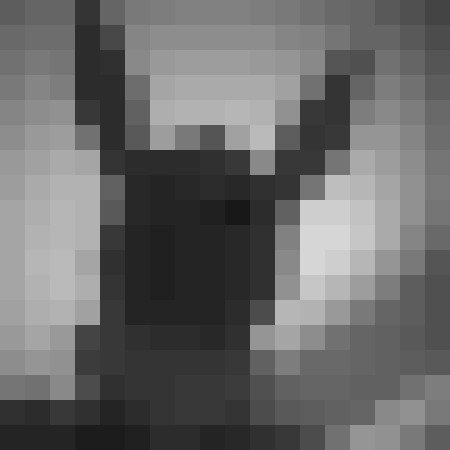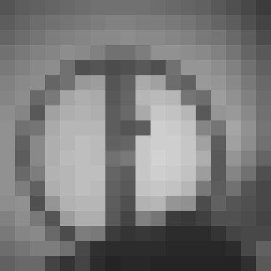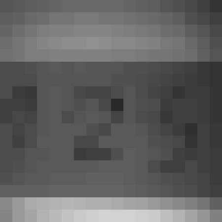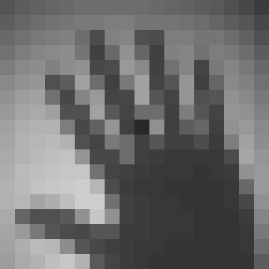
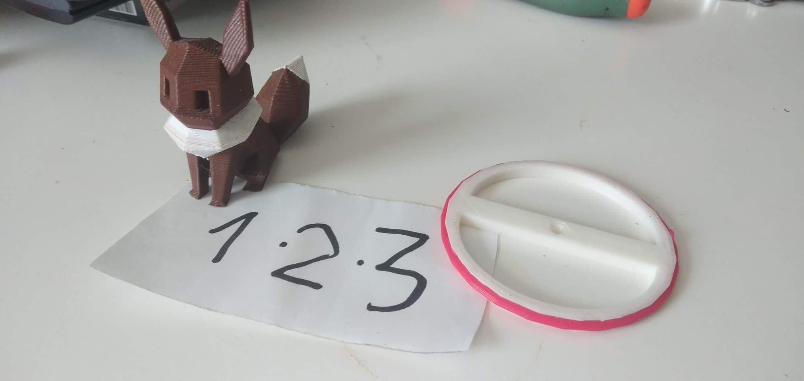
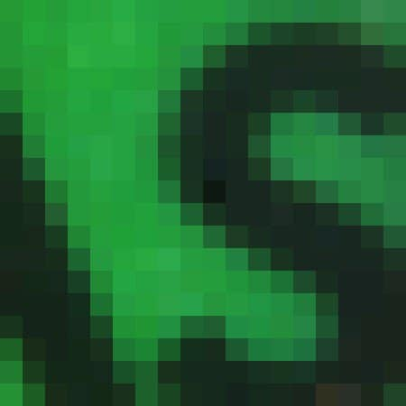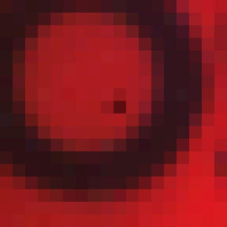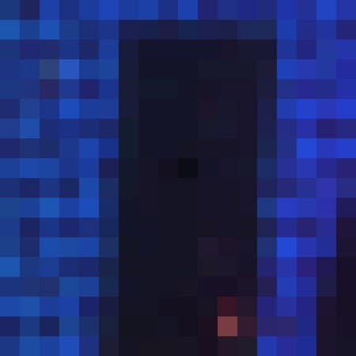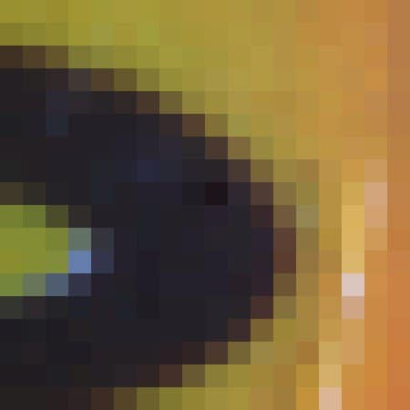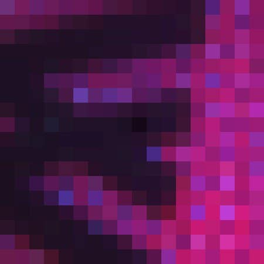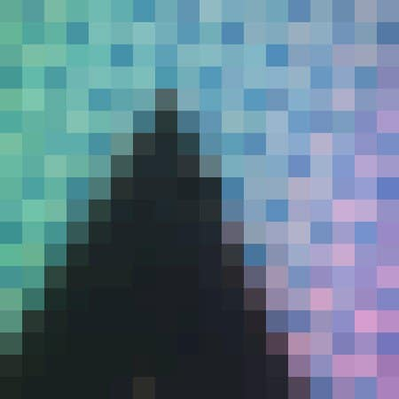

------------

Happy mouse hacking!

The library is based on code by Conor Peterson (robotrobot@gmail.com), at https://conorpeterson.wordpress.com/2010/06/04/optical-mouse-hacking-part-1/
